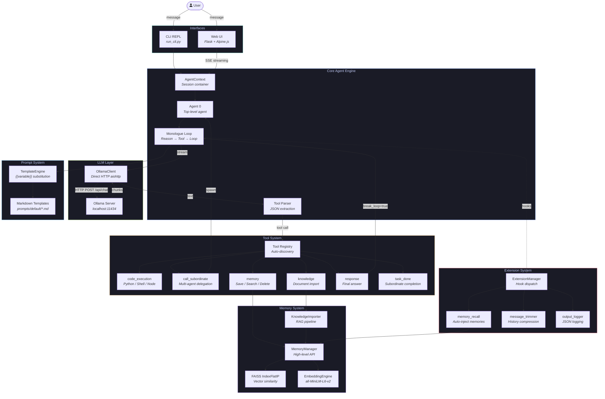
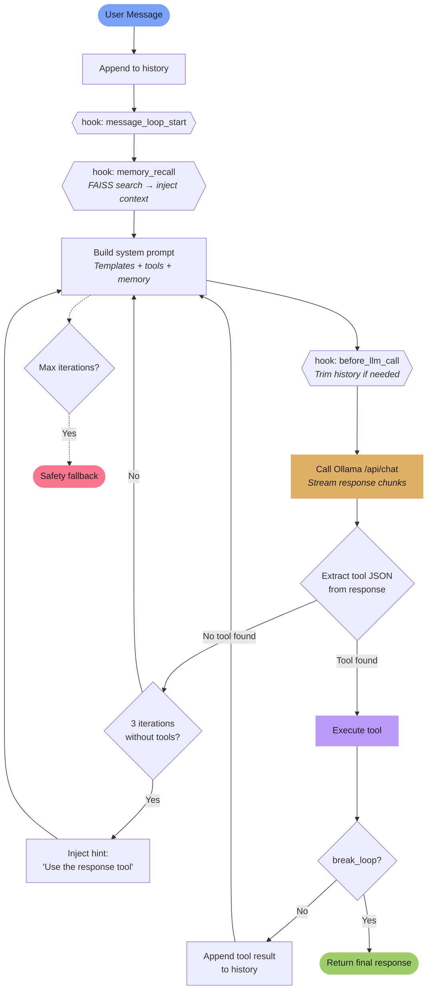
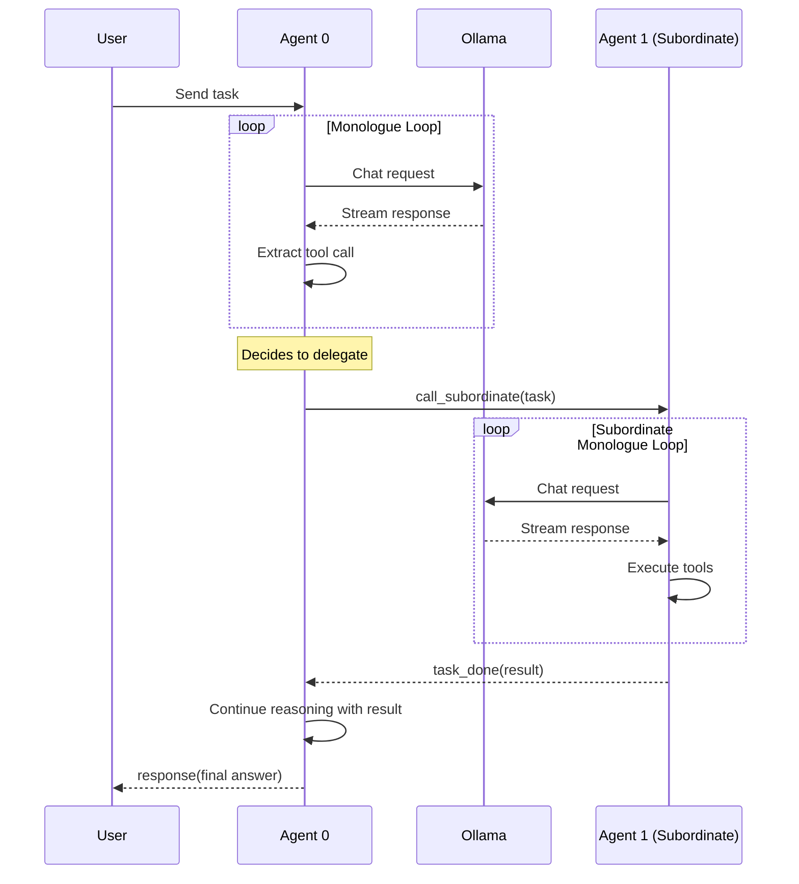
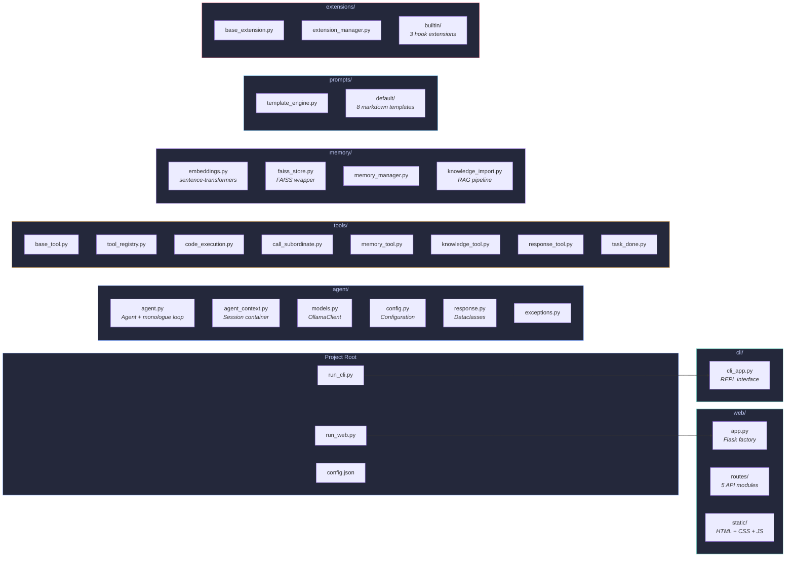

# Local Ollama Agents

A local multi-agent AI framework powered entirely by Ollama — monologue loop, multi-agent delegation, FAISS memory, extensible tools — running 100% locally with no cloud APIs.

## Features

- **Monologue Loop** — agents reason, use tools, observe results, and loop until they have an answer
- **Multi-Agent Hierarchy** — Agent 0 delegates to subordinate agents for complex tasks
- **Code Execution** — persistent Python, Shell, and Node.js sessions
- **FAISS Memory** — vector-based persistent memory with semantic search
- **Knowledge Import** — RAG pipeline for .txt, .md, .pdf, .csv, .html, .json documents
- **Extension System** — lifecycle hooks for memory recall, history trimming, logging
- **Web UI** — Flask + Alpine.js with real-time SSE streaming
- **CLI Mode** — interactive REPL with colored streaming output
- **Fully Local** — direct HTTP to Ollama, local sentence-transformers embeddings

## Architecture

### System Overview



### Monologue Loop (Core Algorithm)



### Multi-Agent Delegation



### Project Structure



## Quick Start

### 1. Install Ollama

```bash
# macOS
brew install ollama

# or download from https://ollama.com
```

### 2. Pull a model

```bash
ollama pull llama3.2
```

### 3. Install dependencies

```bash
pip install -r requirements.txt
```

### 4. Run

**CLI mode:**
```bash
python run_cli.py
```

**Web UI:**
```bash
python run_web.py
# Open http://localhost:5000
```

### Docker (Optional)

Run the full stack with Ollama + agent in containers:

```bash
docker compose up --build
```

The agent will be available at `http://localhost:5000`. The Ollama service is exposed at `http://localhost:11434`.

## Configuration

Edit `config.json` to change models, temperatures, context lengths, and memory settings:

```json
{
  "chat_model": {
    "model_name": "llama3.2",
    "base_url": "http://localhost:11434",
    "temperature": 0.7,
    "ctx_length": 8192
  },
  "utility_model": {
    "model_name": "llama3.2",
    "temperature": 0.3,
    "ctx_length": 4096
  },
  "embedding_model": "all-MiniLM-L6-v2",
  "max_monologue_iterations": 25,
  "memory_recall_enabled": true,
  "memory_recall_threshold": 0.6,
  "memory_recall_count": 5
}
```

## How It Works

1. You send a message to Agent 0
2. Agent enters the **monologue loop**
3. System prompt is assembled from markdown templates + tool descriptions + recalled memories
4. Ollama generates a streaming response
5. Tool calls are extracted from JSON blocks in the response
6. Tools execute (code, memory search, subordinate delegation, etc.)
7. Results feed back into the loop
8. Loop breaks when the agent calls the `response` tool with its final answer

## Tools

| Tool | Description |
|------|-------------|
| `response` | Deliver final answer to user |
| `code_execution` | Run Python/Shell/Node.js in persistent sessions |
| `call_subordinate` | Delegate tasks to subordinate agents |
| `memory` | Save, search, delete, forget memories |
| `knowledge` | Import documents into the knowledge base |
| `task_done` | Subordinate signals completion |

## Tech Stack

| Component | Technology |
|-----------|-----------|
| LLM | Ollama (direct HTTP) |
| Embeddings | sentence-transformers (all-MiniLM-L6-v2) |
| Vector DB | FAISS (faiss-cpu, IndexFlatIP) |
| Backend | Python 3.11+, Flask |
| Frontend | Alpine.js, vanilla CSS |
| Streaming | Server-Sent Events (SSE) |

## License

MIT
